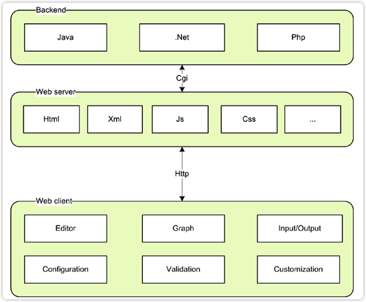

# 概览

mxGraph 包含一个用javascript写 的客户端，和一些列语言的服务端。客户端软件是一个图形组件，带有集成到现有 Web 界面的可选应用程序包装器。客户端需要一个网络服务器来将所需的文件传送到客户端，或者可以在没有网络服务器的情况下从本地文件系统运行。后端可以按原样使用，也可以以一种受支持的语言嵌入到现有的服务器应用程序中。

如果存在后端，则客户端可以配置为以各种方式使用该后端，例如：

创建图像
存储和加载图表
创建图形的对象表示
上述场景可以通过多种方式组合，例如在发生每个更改时将每个更改的 XML 描述发送到后端，或者自动保存图表以避免客户端上的数据丢失。客户端也可以在离线模式下运行，不需要后端或网络服务器。

# 2 helloworld 示例

